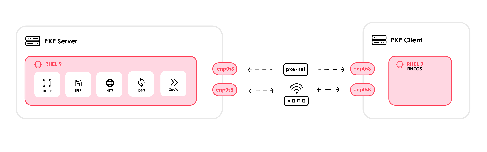

# PXE-Booting Single Node OpenShift - Lab

In this lab we will PXE-boot a Single Node OpenShift Cluster between two VMs using Vagrant (VirtualBox), with DHCP/TFTP/HTTP/DNS/Proxy servers.

This lab builds upon the rhel9-pxe-vagrant-lab's PXE-Boot process, which serves as a prerequisite. This lab assumes you already have a PXE Server configured from the previous lab.

Link to previous lab: https://github.com/notsnapback/rhel9-pxe-vagrant-lab/tree/main


## Prerequisites

- Working PXE server from the previous lab (same network and IPs).
- VirtualBox + Vagrant installed on your host.
- RHEL-based PXE server with `httpd`, `tftp-server`, `dhcp-server` configured.

## Background: What is RHCOS (and why we PXE-boot it)

**Red Hat Enterprise Linux CoreOS (RHCOS)** is the operating system used for OpenShift control-plane nodes. Worker nodes can be either RHCOS or RHEL, but RHCOS is usually preferred because it’s managed by the cluster and kept consistent across all nodes.

RHCOS is built from RHEL components, but it’s delivered as an image with **controlled immutability**: most of the system isn’t changed by hand on the host. Instead, it’s configured through **Ignition** on first boot and then managed by the cluster’s **Machine Config Operator (MCO)** afterward. This makes lifecycle management simpler and safer. OpenShift coordinates configuration and updates instead of you patching each node by hand.

In this lab we **PXE-boot** the RHCOS installer artifacts (`vmlinuz`, `initrd.img`, and `rootfs.img`) so the node can fetch Ignition data and join the cluster with the desired configuration from day one.

## Topology



**Why DNS**

- OpenShift expects a few names to resolve:  
  `api.<CLUSTER_NAME>.<BASE_DOMAIN>`, `api-int.<CLUSTER_NAME>.<BASE_DOMAIN>`, and `*.apps.<CLUSTER_NAME>.<BASE_DOMAIN>`.
- `dnsmasq` on the PXE server answers these, pointing them at the SNO VM’s PXE IP.

**Why a forward proxy**

- Some cluster components/pods need outbound HTTP/HTTPS (pulling release/operator images, update checks, Insights, etc.).

**PXE boot flow (SNO)**

1. The SNO VM boots on the PXE NIC and gets an IP from **DHCP**; it’s told where to fetch the bootloader (`next-server`/`filename`).
2. Via **TFTP**, it downloads the **agent-based installer** kernel (`vmlinuz`) and initrd; via **HTTP**, it fetches `rootfs.img`.
3. The agent starts, uses your `install-config.yaml` + `agent-config.yaml` (with the **rendezvous IP**) to provision the node.
4. The disk is written with RHCOS; the VM reboots into the new cluster.
5. The **Cluster Version Operator** pulls the release payload/operators (through Squid), DNS resolves API/ingress, and the SNO becomes Ready.

**Why isolate the PXE network**

- Prevents accidental DHCP conflicts on your LAN and keeps all boot/install traffic contained while you iterate.

---

# PXE-Boot Process (Creating the Single Node Cluster via the Agent-based Installer)

Run these commands on your PXE Server

> **Note:** You should run these commands as the root user

## Configure DNS (dnsmasq)

We run **dnsmasq** for lightweight DNS on the PXE segment so the SNO node can resolve
`api.sno1.lab.local`, `api-int.sno1.lab.local`, and `*.apps.sno1.lab.local`.

**Why this matters:** OpenShift is very particular about DNS. The installer, the API server, and the Ingress router all expect a few **specific names** to resolve. These names are baked into TLS certificates and into your kubeconfig. If they don’t resolve (or resolve to the wrong IP), the install stalls waiting for the API, `oc login` fails, and the web console/Routes never come up.

- `api.<CLUSTER_NAME>.<BASE_DOMAIN>` — the public Kubernetes API endpoint your
  kubeconfig talks to.
- `api-int.<CLUSTER_NAME>.<BASE_DOMAIN>` — the internal API name used by cluster
  components during bootstrap.
- `*.apps.<CLUSTER_NAME>.<BASE_DOMAIN>` — a wildcard for application Routes
  served by the OpenShift router.

### Install dnsmasq

```bash
dnf install -y dnsmasq
```

Create /etc/dnsmasq.d/sno1.conf:

```bash
vim /etc/dnsmasq.d/sno1.conf
```

Insert the following:

```bash
# Listen on loopback and the PXE NIC address
listen-address=<PXE_SERVER_IP>
bind-interfaces

# Use lab domain; expand short names to FQDNs (e.g., sno1 → sno1.lab.local)
domain=<BASE_DOMAIN>
expand-hosts

# OpenShift API/ingress records → SNO node IP
address=/api.sno1.lab.local/<PXE_CLIENT_IP>
address=/api-int.sno1.lab.local/<PXE_CLIENT_IP>
address=/.apps.sno1.lab.local/<PXE_CLIENT_IP>

# Upstream resolver for everything else
server=<UPSTREAM_DNS_IP>   # e.g., 8.8.8.8

# Safer defaults for a lab
domain-needed
bogus-priv
log-queries

```

Enable & open firewall:

```bash
systemctl enable --now dnsmasq
firewall-cmd --permanent --add-service=dns
firewall-cmd --reload
```

Test the DNS:

```bash
dig +short api.sno1.lab.local @<PXE_SERVER_IP>
dig +short api-int.sno1.lab.local @<PXE_SERVER_IP>
dig +short test.apps.sno1.lab.local @<PXE_SERVER_IP>
```

> Make sure to update resolv.conf file on the pxe server and add the <PXE_SERVER_IP>, or you could edit your hosts file if you'd prefer

## Configure the Forward Proxy

We added a simple forward proxy (Squid) because even though the node was able to reach the Internet, the **cluster components and pods** also needed outbound HTTP/HTTPS during the install. During the installation the cluster components pull the OpenShift release and operator images, the Cluster Version Operator checks for updates, and the Insights Operator talks to `console.redhat.com`, which is why they need internet access. The cluster sends its outbound HTTP/HTTPS traffic through Squid (httpProxy/httpsProxy), while noProxy excludes internal ranges, so in-cluster traffic stays direct.

### Install Squid

```bash
dnf install -y squid
```

Edit `/etc/squid/squid.conf` (adapt the ranges and IPs to your lab):

```bash
vim /etc/squid/squid.conf
```

Add these lines to the default config:

```conf
# Prefer IPv4 so we don't hang on IPv6-only upstreams
dns_v4_first on

# Make it a pure forwarder (no cache surprises)
cache deny all
via off
forwarded_for off

# Be explicit about what can use the proxy (pod/service + lab subnets)
acl openshift src 10.128.0.0/14 172.30.0.0/16 <PXE_SUBNET>
http_access allow openshift

tcp_outgoing_address <BRIDGED_NIC_IP>
```

Enable & open firewall:

```bash
systemctl enable --now squid
firewall-cmd --permanent --add-port=3128/tcp   # or: --add-service=squid
firewall-cmd --reload
```

## Get the OpenShift tools

Create an SSH key for cluster access (The public key will go into the install-config.yaml)

> **Note:** Make sure to save this key for later

```bash
ssh-keygen
```

> You may need to disable **fapolicyd**."The File Access Policy Daemon, fapolicyd, is a service that can be used to help protect a system by limiting which applications have permission to run" - Oracle's Docs. The protection that fapolicyd offers can interfere with the OpenShift installer tool. To disable it run the following below:

```bash
systemctl stop fapolicyd
systemctl disable fapolicyd
```

> Oracle's Documenation on fapolicyd: https://docs.oracle.com/en/operating-systems/oracle-linux/8/fapolicyd/fapolicyd-About.html

Download client + installer (RHEL9 builds):

```bash
wget https://mirror.openshift.com/pub/openshift-v4/x86_64/clients/ocp/stable/openshift-install-rhel9-amd64.tar.gz
wget https://mirror.openshift.com/pub/openshift-v4/x86_64/clients/ocp/stable/openshift-client-linux-amd64-rhel9.tar.gz

tar -xvf openshift-client-linux-amd64-rhel9.tar.gz
tar -xvf openshift-install-rhel9-amd64.tar.gz

mv oc kubectl /usr/local/bin
mv openshift-install-fips /usr/local/bin

openshift-install-fips version
```

## Prepare the agent configs

Create a directory for the agent config files:

```bash
mkdir ocp-pxe
cd ocp-pxe
```

Create the install-config.yaml:

```bash
vim install-config.yaml
```

This file tells the installer your cluster basics including the name and base domain, **single-node** topology (1 control plane, 0 workers), and the **cluster/service/machine** networks. It also sets the cluster’s HTTP(S) proxy for egress, declares `platform: none` (bare-metal style), and includes your **pull secret** and **SSH public key** for access.

```yaml
apiVersion: v1
baseDomain: <BASE_DOMAIN>
compute:
  - name: worker
    replicas: 0
controlPlane:
  name: master
  replicas: 1
metadata:
  name: <CLUSTER_NAME>
networking:
  clusterNetwork:
    - cidr: 10.128.0.0/14
      hostPrefix: 23
  machineNetwork:
    - cidr: <PXE_SUBNET> # exp: 192.168.20.0/24
  networkType: OVNKubernetes
  serviceNetwork:
    - 172.30.0.0/16
proxy:
  httpProxy: http://<PXE_SERVER_IP>:3128
  httpsProxy: http://<PXE_SERVER_IP>:3128
  noProxy: .cluster.local,.svc,localhost,127.0.0.1,10.128.0.0/14,172.30.0.0/16,<PXE_SUBNET>,.lab.local
platform:
  none: {}
pullSecret: '<YOUR_PULL_SECRET_JSON>'
sshKey: |
  <YOUR_SSH_PUBLIC_KEY>
```

> Get your `<YOUR_PULL_SECRET_JSON>` from Red Hat’s Hybrid Cloud Console: sign in at https://console.redhat.com → **OpenShift** → **Downloads** → **Red Hat OpenShift pull secret** → **Copy**. You will need a Red Hat Developer account in order to do this.

> Paste it into `install-config.yaml` as a single JSON string. Wrap it in **single quotes** to avoid YAML quoting issues

Create the agent-config.yaml:

```bash
vim agent-config.yaml
```

This file tells the **agent-based installer** about the host that will form your SNO cluster and exactly how to network it. It pins the PXE NIC by **MAC address**, assigns a **static IP** (`<PXE_CLIENT_IP>`), points DNS to the PXE server, and sets the **rendezvousIP** (the node used to coordinate bootstrap).

```yaml
apiVersion: v1beta1
kind: AgentConfig
metadata:
  name: <CLUSTER_NAME>
rendezvousIP: <PXE_CLIENT_IP>
hosts:
  - hostname: <CLUSTER_NAME>
    interfaces:
      - name: <PXE_NIC> # PXE intnet
        macAddress: <PXE_MAC_ADDRESS>
    rootDeviceHints:
      deviceName: /dev/sda
    networkConfig:
      dns-resolver:
        config:
          server:
            - <PXE_SERVER_IP> # your lab DNS (serves *.lab.local)
          search:
            - <BASE_DOMAIN>
      interfaces:
        - name: <PXE_NIC>
          type: ethernet
          state: up
          mac-address: <PXE_MAC_ADDRESS>
          ipv4:
            enabled: true
            dhcp: false
            address:
              - ip: <PXE_CLIENT_IP>
                prefix-length: 24
```

## Generate PXE artifacts with the agent installer

> (Optional) If your /tmp doesn't have enough space, pick another directory for temp:

```bash
mkdir -p /var/lib/ocp-pxe-tmp
export TMPDIR=/var/lib/ocp-pxe-tmp
```

Install `nmstatectl` as a prerequisite to build `agent-config.yaml` networkConfig

`nmstatectl` lets you capture or craft the NMState YAML for the **PXE client’s** NIC (the YAML goes under `hosts[].networkConfig` in `agent-config.yaml`).

Run these commands to install it:

```bash
dnf install -y nmstate
nmstatectl --version
```

Generate PXE files:

```bash
openshift-install-fips agent create pxe-files --dir /root/ocp-pxe
```

This creates the boot-artifacts/agent.x86_64-{vmlinuz,initrd.img,rootfs.img} under the directory you specify (In this case it's `/root/ocp-pxe`)

## Stage RHCOS artifacts to TFTP/HTTP

```bash
mkdir -p /var/lib/tftpboot/pxelinux/images/RHCOS/

cp /root/ocp-pxe/boot-artifacts/{agent.x86_64-rootfs.img,agent.x86_64-vmlinuz,agent.x86_64-initrd.img} /var/lib/tftpboot/pxelinux/images/RHCOS/

cd /var/lib/tftpboot/pxelinux/images/RHCOS

mv agent.x86_64-rootfs.img rootfs.img
mv agent.x86_64-vmlinuz vmlinuz
mv agent.x86_64-initrd.img initrd.img

chmod 755 /var/lib/tftpboot/pxelinux/images/RHCOS
chmod 644 /var/lib/tftpboot/pxelinux/images/RHCOS/{vmlinuz,initrd.img,rootfs.img}

# Serve rootfs over HTTP (simplest path)
cp rootfs.img /var/www/html/
ls -ltr /var/www/html/

# If the file isn’t world-readable (`644`) or has the wrong SELinux label, Apache returns `403 Forbidden`

chmod 644 /var/www/html/rootfs.img
restorecon -v /var/www/html/rootfs.img
```

## Add a PXE menu entry (BIOS) in pxelinux.cfg/default to boot the agent image:

```bash
vim /var/lib/tftpboot/pxelinux/pxelinux.cfg/default
```

Add the following menu entry:

```cfg
label rhcos-sno
  menu label ^Install OpenShift
  kernel images/RHCOS/vmlinuz
  append initrd=images/RHCOS/initrd.img nameserver=<PXE_SERVER_IP> ip=dhcp coreos.live.rootfs_url=http://<PXE_SERVER_IP>/rootfs.img ignition.firstboot ignition.platform.id=metal
```

## Adding UEFI PXE Boot (GRUB2) Option

UEFI clients don’t use `pxelinux.0`; they load a UEFI bootloader (`BOOTX64.EFI`) which then reads a **GRUB config**. Here’s the minimal setup to serve that from TFTP.

Follow these steps to enable PXE booting with UEFI firmware

Add a menu entry to the grub.cfg file:

```bash
vim /var/lib/tftpboot/redhat/EFI/BOOT/grub.cfg
```

Enter the follwing:

```bash
menuentry 'OpenShift' {
  linuxefi /pxelinux/images/RHCOS/vmlinuz ip=dhcp nameserver=<PXE_SERVER_IP> coreos.live.rootfs_url=http://<PXE_SERVER_IP>/rootfs.img ignition.firstboot ignition.platform.id=metal
  initrdefi /pxelinux/images/RHCOS/initrd.img
}
```

Ensure TFTP is running

```bash
systemctl enable --now tftp.socket
```

## Creating the PXE Client (BIOS PXE boot)

You will follow the same process as you did for RHEL 9. You can use Vagrant to create the second VM to serve as the PXE Client.

1. When you first PXE-Boot the client, have boot1 set to `net` and boot2 set to `disk`

```bash
"--boot1", "net",
"--boot2", "disk",
```

2. When it is finished and it reboots, use `vagrant halt` to stop the VM and switch the boot order so it now boots from disk

```bash
"--boot1", "disk",
"--boot2", "net",
```

## Booting via UEFI

> If you decide to boot via UEFI make sure the vagrant file includes `"--firmware", "efi",`

> **Note:** UEFI PXE booting for OpenShift is not supported in VirtualBox. On version 7.1, UEFI boot fails entirely and never reaches the Assisted Installer. On version 7.0, both BIOS and UEFI modes reach the Assisted Installer but fail during that stage. At this time, the only reliable option is to use BIOS mode on VirtualBox 7.1, or consider another hypervisor if UEFI support is required.

> I kept these instructions in anyway, because in theory UEFI booting would work if VirtualBox supported it better... maybe in the near future 🤷‍♀️

1. When you start the PXE Client VM via the `vagrant up` command close the dialog that pops up


2. Press `Esc` a couple times to enter the BIOS


3. Once your in the BIOS select `Boot Manager`


4. Then select one of the UEFI PXEv4 options (select the one that corresponds to the PXE NIC)

## Watch the progress & access the cluster (Run these commands from your PXE Server)

### Update `resolv.conf` on the PXE Server

In order for the PXE server itself to resolve the OpenShift API and application domains, you’ll need to add the PXE server’s own IP address to `/etc/resolv.conf`.

For example, if your PXE server is at `192.168.20.2`, edit `/etc/resolv.conf`:

```bash
sudo vi /etc/resolv.conf
```

Add the following at the top (or make sure it exists):

```bash
nameserver 192.168.20.2
```

This ensures that when you run the final openshift-install wait-for ... or oc commands from the PXE server, DNS resolution will succeed.

### Tracking the progress of the Install

Track the progress of the installer by running the following command:

```bash
# Shows high-level milestones and errors until the cluster is ready
openshift-install-fips wait-for install-complete --dir /root/ocp-pxe --log-level=debug
```

You can use the generated kubeconfig to try and access the cluster as it comes up:

```bash
oc get nodes -A --kubeconfig /root/ocp-pxe/auth/kubeconfig

# Option B: set it for your shell
export KUBECONFIG=/root/ocp-pxe/auth/kubeconfig
oc get nodes -A
```

(Optional: SSH into the core user on the node for viewing logs and troubleshooting)

```bash
# to edit known hosts in case you need to chnage or delete the entries
vim /root/.ssh/known_hosts
# The SSH key is the one you put in install-config.yaml
ssh -i ~/.ssh/id_rsa core@<PXE_CLIENT_IP>
# Follow key services
journalctl -b -f -u kubelet
journalctl -b -f -u release-image.service -u bootkube.service
```

## Post-Install

### Update Your Host Laptop’s Hosts File

To access the OpenShift web console (dashboard) from your laptop, you need to point the cluster’s ingress and API domains to the bridged NIC IP of the PXE client (the SNO node).

Edit your /etc/hosts (Linux/macOS) or
C:\Windows\System32\drivers\etc\hosts (Windows) file and add entries similar to:

```bash
<PXE_CLIENT_BRIDGED_IP>  console-openshift-console.apps.sno1.lab.local
<PXE_CLIENT_BRIDGED_IP>  oauth-openshift.apps.sno1.lab.local
<PXE_CLIENT_BRIDGED_IP>  api.sno1.lab.local
```

After updating, you should be able to open the OpenShift console in your browser at:
https://console-openshift-console.apps.sno1.lab.local

### Connect to the cluster from the CLI

> Based on the workflow described in Red Hat’s article: https://developers.redhat.com/articles/2024/04/29/how-install-single-node-openshift-aws?utm_source=chatgpt.com#creating_the_iam_user

You can manage your SNO from the **web console** or the **`oc`** command line. Here’s the easiest way to wire up `oc` without handling kubeconfig files manually.

**Prereqs:** `oc` installed and network access to the API (`https://api.<cluster>.<domain>:6443`).

#### Use the web console’s “Copy login command”

1. Open the OpenShift **web console** and sign in.

2. In the top-right user menu (e.g., **kubeadmin**), click **Copy login command**.


3. A new tab opens. Click **Display token** to reveal a ready-to-paste command like:

```bash
oc login --token=<REDACTED> --server=https://api.<cluster>.<domain>:6443
```

Paste that into your terminal. Verify:

```bash
oc whoami
oc get nodes
```

Best of Luck :)

## References & Additional Informarion:

https://www.redhat.com/en/blog/red-hat-enterprise-linux-coreos-customization
